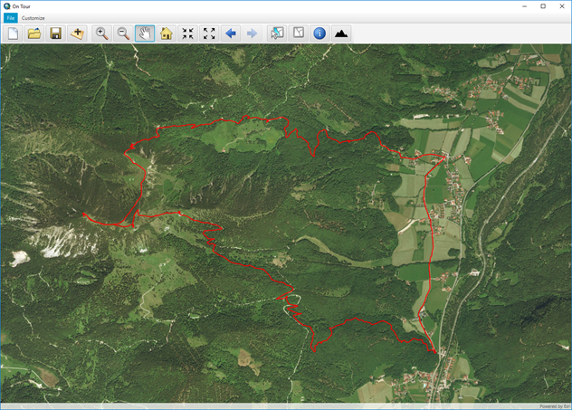
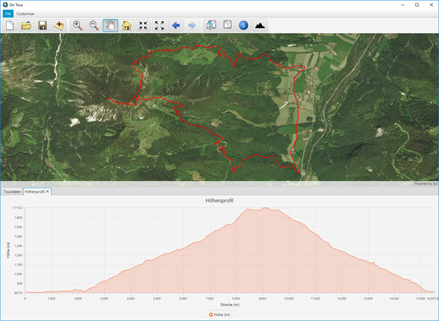

# GPX-Tour-Explorer
GPX-Tour-Explorer is a desktop application, which allows you to open GPX files of your tours, show them on the map and also display a profile for the tour. The application is written in Java and uses the ArcGIS Runtime SDK for Java:
  

## Functionality
* Open a GPX file and show it on the map
* Map navigation (zoom in, zoom out, pan, previous extent, next extent)
* Show a profile for the GPX track

 
